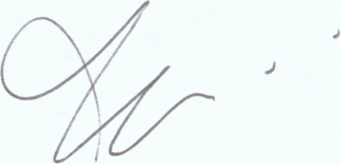
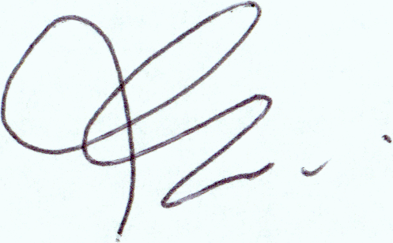
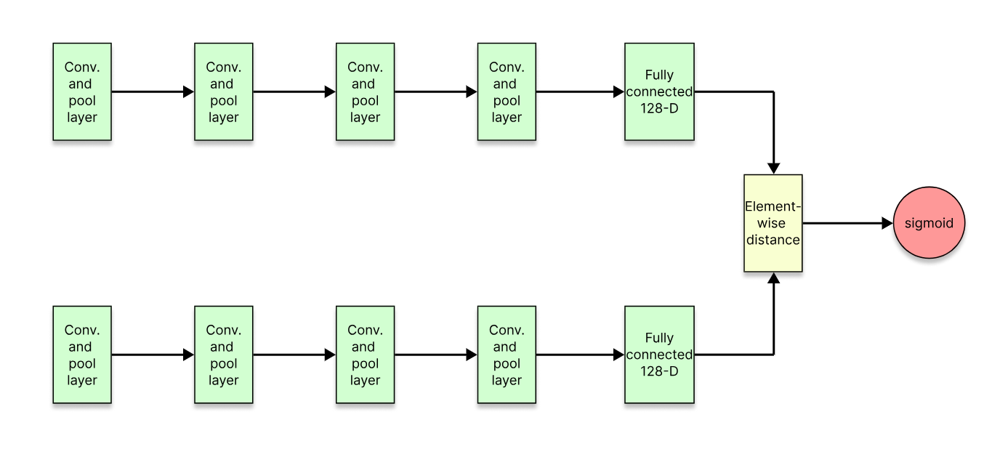
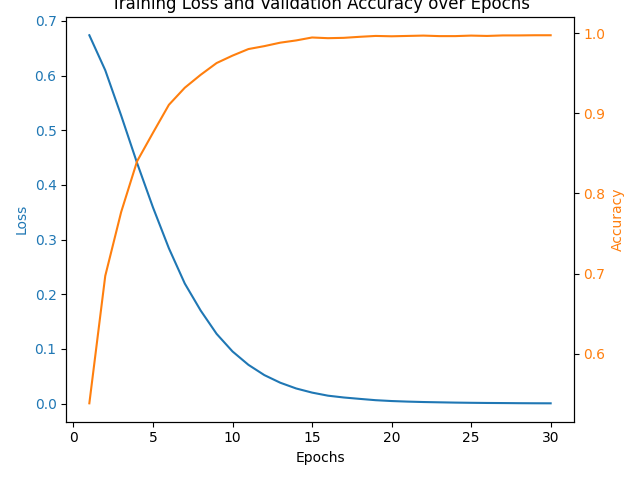

# Signature Verification using Siamese Neural Networks

This project implements a signature verification system using Siamese Neural Networks (SNN) with PyTorch. The system is designed to compare two signature images and determine if they are from the same person.

## Features

- Siamese Neural Network architecture for signature comparison
- Convolutional Neural Network (CNN) for feature extraction
- Data loading and preprocessing using PyTorch's Dataset and DataLoader
- Training with mixed precision using torch.cuda.amp
- Learning rate scheduling with StepLR
- Validation during training
- Model saving and loading
- Test functionality for individual image pairs and bulk testing'

The model is able to accurately distinguish between forged and genuine signatures:

**Genuine:**

 


**Forged:**

 

## Requirements

- Python 3.x
- PyTorch
- torchvision
- pandas
- Pillow
- tqdm

## Project Structure

- `train.py`: Main script for training and testing the model
- `network.py`: Contains the SNN and CNN model definitions
- `sign_data/`: Directory containing the dataset
  - `train_data.csv`: CSV file with training data pairs
  - `test_data.csv`: CSV file with test data pairs
  - `Dataset/`: Directory containing the actual signature images
    - `train/`: Training images
    - `test/`: Test images

## Usage

First download the [dataset](https://www.kaggle.com/datasets/robinreni/signature-verification-dataset) and place it in the project directory.

### Training the Model

To train the model, run:

```
python train.py train
```

This will start the training process using the data specified in `sign_data/train_data.csv`. The best model will be saved as `best_model.pth`, and the final model will be saved as `model_last.pth`.

### Testing the Model

To test the model on the entire test set, run:

```
python train.py test
```

This will evaluate the model on all pairs specified in `sign_data/test_data.csv` and print the overall accuracy.

### Using the Model

To use the trained model for comparing two specific signatures, you can use the `test()` function in `train.py`. Example usage:

```python
result = test('path/to/image1.jpg', 'path/to/image2.jpg')
print(f"Similarity score: {result}")
```

## Model Architecture




The model consists of two main components:

1. A Convolutional Neural Network (CNN) for feature extraction
2. A Siamese Neural Network (SNN) that uses the CNN to compare two images

The CNN architecture includes:
- 4 convolutional layers with ReLU activation and max pooling
- A fully connected layer that outputs a 128-dimensional feature vector

The SNN takes the absolute difference between the feature vectors of two images and passes it through a final fully connected layer to produce a similarity score.

## Hyperparameters

- Learning rate: 0.002
- Batch size: 64
- Epochs: 10
- Learning rate scheduler: StepLR with step size 5 and gamma 0.5

## Dataset

The [dataset](https://www.kaggle.com/datasets/robinreni/signature-verification-dataset) was aquired from kaggle, it is a restructured version of a dataset from a competition on detecting signature authenticity. It contains genuine and forged signatures of varying degrees, some of the forged signatures are from skilled forgers and the rest are from ordinary people trying to replicate signatures.

## Performance

The model was trained for 10 epochs, however the model achieved 100% accuracy on the test set after 3 epochs. (This worked better than I expected)



## Future Improvements

- Implement data augmentation to increase the robustness of the model
- Experiment with different CNN architectures or pre-trained models
- Add more evaluation metrics such as False Accept Rate (FAR) and False Reject Rate (FRR)
- Implement cross-validation for more reliable performance estimation

## License

This project is licensed under the MIT License - see the [LICENSE](LICENSE) file for details.


## Acknowledgements

- https://medium.com/analytics-vidhya/siamese-neural-network-for-signature-verification-efd2f399d586(Providing a general overview on the problem, and also the basis of the neural network architecture.)
- [dataset](https://www.kaggle.com/datasets/robinreni/signature-verification-dataset)